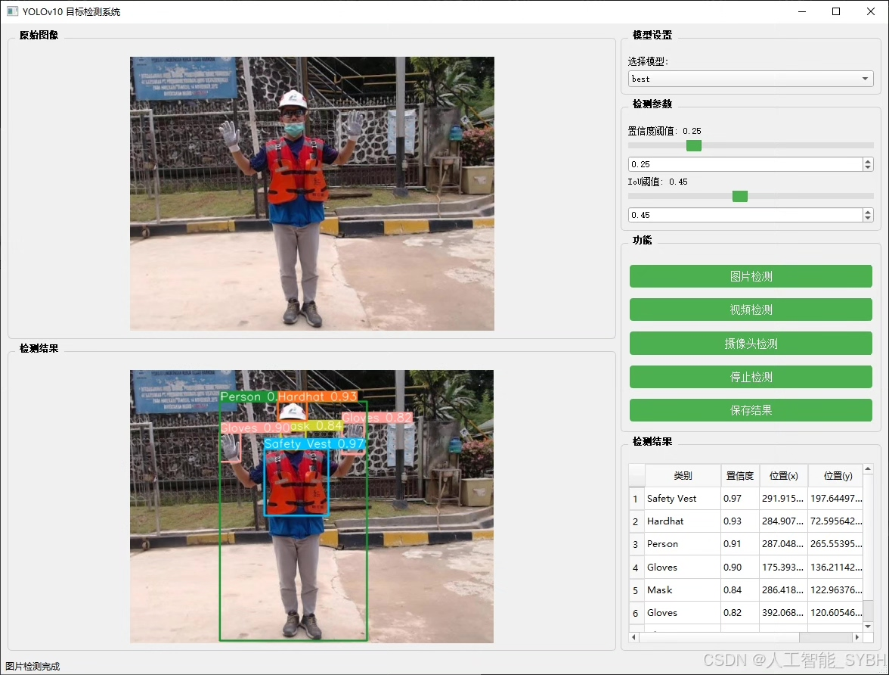
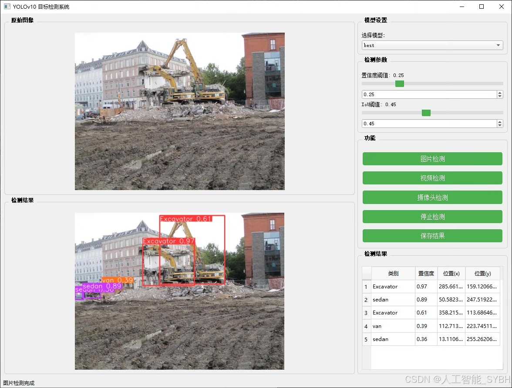
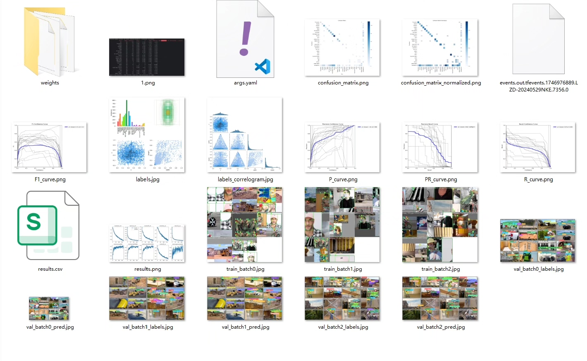
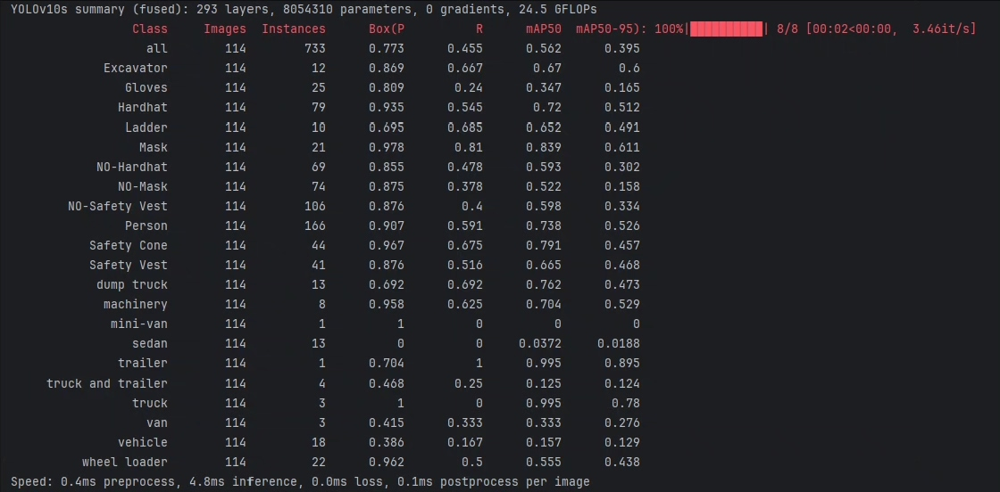
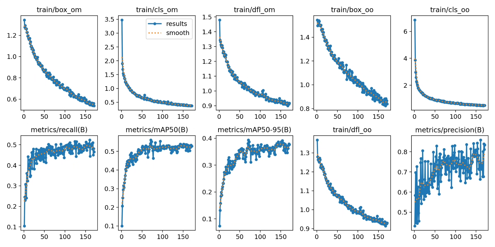
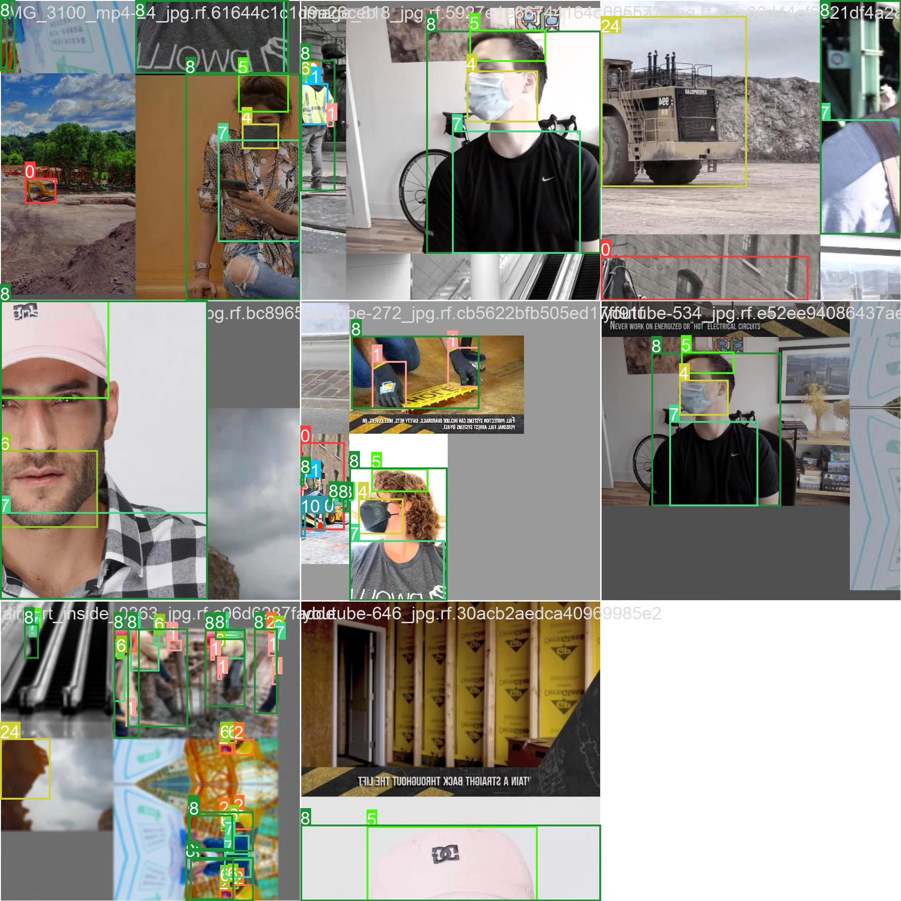
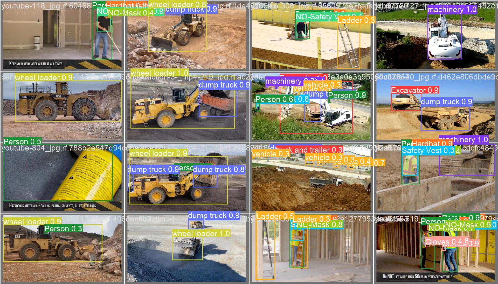
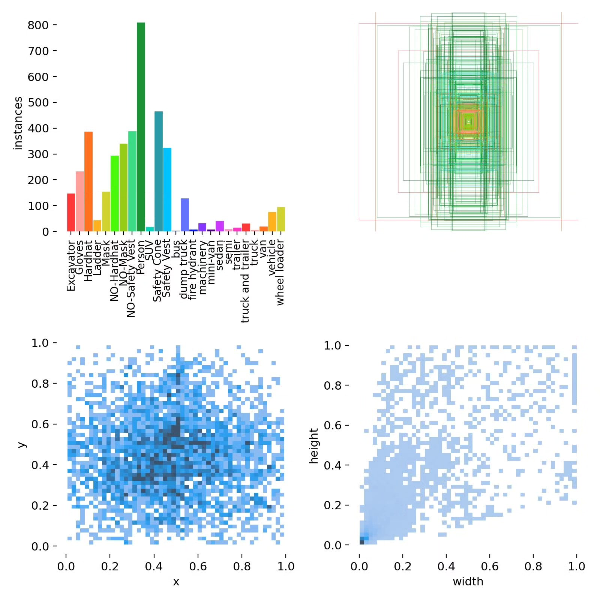

# Based on deep learning YOLOv10, construction site safety detection system

## Body

Based on the YOLOv10 object detection algorithm, a construction site safety detection system has been developed. This project is specifically designed for monitoring safety compliance in the construction environment. The system can detect 25 common objects on construction sites in real-time, including personal protective equipment (such as safety helmets, reflective vests, masks, etc.), various construction machinery (such as excavators, loaders, etc.), and construction vehicles (trucks, trailers, etc.). Through deep learning technology, the system can automatically identify violations without wearing protective equipment and issue alerts in a timely manner, effectively improving the level of safety management in construction sites. The project uses a custom dataset containing 717 labeled images for training and validation, with an average accuracy reaching industrial application standards.

The company's products have obtained YOLO official commercial license certification.

We provide after-sales service.

After payment, we will provide WeChat ID to answer questions at any time.

Environmental configuration: We will provide a tutorial on environmental configuration, and WeChat will provide答疑.

Remote installation service: If you need remote configuration, an additional fee of 69 is required,

Configuration failure, all fees are refunded (specially for old computers only refund installation fees)

Retraining dataset: After configuring the environment, you can train on your own computer.
If you need us to retrain, just pay 69+ computing power fees (2.5 yuan/hour)

Full after-sales service

## Images

## Payment

Here is a pay link on Stripe ( https://buy.stripe.com/3cs8yP7sY87d0vu9AB ). Please contact me lonlonago@foxmail.com after funding $89, and I will send you a complete data files , thank you!

